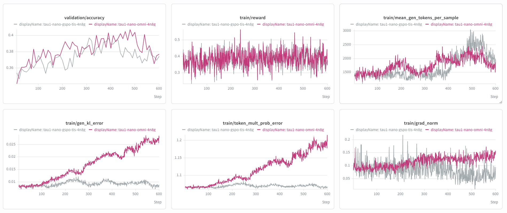

# Conversational Tool Use (Pivot RL) — Experiment Results, Part 2

Follow-up to `exp.md`. All tau2-bench numbers are average reward (x100),
4 trials per task, gpt-5.6-luna user simulator. tau-voice is the half-duplex harness from Part 2 of
`exp.md` (user turns are Chatterbox-Turbo TTS audio, agent listens and
replies in text).

## Part 1: Fixing the train/generation logprob divergence (gen_kl_error)

Model under study: Nemotron-3-Nano-Omni-30B-A3B-Reasoning-BF16, trained with
pivot RL on the public text dataset
(`nvidia/Nemotron-RL-Agentic-Conversational-Tool-Use-Pivot-v1`, 96K rows).

The baseline think-arm run (plain GRPO) shows a monotonic climb of
`train/gen_kl_error` (0.008 → 0.028) and `train/token_mult_prob_error`
(1.07 → 1.20) over 600 steps. Root-caused offline: the RL-sharpened
mamba-hybrid weights become numerically fragile at specific high-frequency
punctuation tokens — three independent implementations (vLLM inference,
Megatron training forward, HF eager) mutually disagree by up to e^10 at those
positions, and fp32 does not reconcile them. No single engine is buggy; the
mismatch is a property of how far the weights drift off the pretrained
manifold, and the uncorrected gradient feeds back into more drift.

Figure: baseline think arm (pink) vs the fixed run (gray). Validation
accuracy and train reward are unaffected, while `gen_kl_error`,
`token_mult_prob_error`, and `grad_norm` stay flat for the fixed run
(gen_kl_error ~0.009 at step 600 vs 0.028; token_mult_prob_error 1.07 vs 1.20).

YAML changes relative to the baseline think arm (`loss_fn` unless noted):

| Setting | baseline | fixed run | role |
|---|---|---|---|
| `use_importance_sampling_correction` | false | **true** | token-level weight π_train/π_gen ≈ 0 at fragile tokens (train≪gen) — silences their gradient; the main driver of the fix |
| `truncated_importance_sampling_type` / `ratio` | null | **tis / 5.0** | caps exploding weights in the opposite direction (train≫gen) |
| `grpo.seq_logprob_error_threshold` | 2 (never fires) | **1.5** | masks whole pathological sequences (fires 1–3 per 1024 late in training) |
| `sequence_level_importance_ratios` + `token_level_loss` | false / true | **true / false** | GSPO: sequence-level ratio dilutes single-token spikes out of the clip decision |
| `ratio_clip_max` | 0.2 | 0.28 | decoupled clip, per the official omni recipes |

### Table 1: tau2-bench, text (luna user sim)

| Model | airline | retail | telecom | avg |
|---|---|---|---|---|
| Nemotron-3-Nano-Omni (no training) | 58.50 | 64.25 | 44.96 | 55.90 |
| + Pivot RL, plain GRPO (step 470) | 61.31 | 60.09 | 50.44 | **57.28** |
| + Pivot RL, GSPO+TIS (step 420) | 60.80 | 62.72 | 46.08 | 56.53 |

### Table 2: tau-voice, half-duplex speech input

airline: base and step 470 are 4 trials (200 sims); GSPO step 420 is 1 trial
(±7 noise at 1σ). retail / telecom: 1 trial.

| Model | airline | retail | telecom | avg |
|---|---|---|---|---|
| Nemotron-3-Nano-Omni (no training) | 50.26 | 39.82 | 25.93 | 38.67 |
| + Pivot RL, plain GRPO (step 470) | 56.57 | 45.13 | 24.56 | **42.09** |
| + Pivot RL, GSPO+TIS (step 420) | 54.35* | 38.36** | 20.19 | 37.63 |

`*` 46/50 scored (4 empty-output runner errors).
`**` only 73/114 scored (41 runaway-thinking failures) — provisional; see
note 4: the same 40 tasks also failed in one base-model run while a repeat
base run scored 113/114, so the failures appear run-conditioned. A rerun of
this cell is in flight.

Analysis

1. **GSPO's sequence-level loss has a behavioral side effect.** Per-sequence
   (instead of per-token) weighting upweights short tool-call rows relative
   to long text rows. Downstream this shows up as a tool-calling bias:
   its `mobile_data_issue` score is 58 vs 81 for step 470, with 1.5x the
   hallucinated device-tool calls, and the same talk-less/tool-more shift
   shows up in voice telecom (assistant text-turn ratio 0.65 vs 0.72),
   where the deficit repeats (20.2 vs 24.6).

2. **Runaway thinking on voice retail is run-conditioned, not (only)
   checkpoint-conditioned.** 40 specific retail tasks made one base run and
   the GSPO run burn the entire reasoning budget and emit nothing (identical
   40/40 failing set; raising the budget 16K→20K did not help, and normal
   turns need only p99 ≈ 5.5K tokens). But a repeat base run scored 113/114
   on the same tasks with max observed reasoning of 7.5K — the trigger is
   likely run-level audio/pipeline state that induces unbounded reasoning,
   not a stable checkpoint property. Voice-retail numbers are only
   comparable between runs with similar scored coverage.

---

## Part 2: Self-profiled difficulty-filtered data

### Data: nano-omni self-rollout profiling

We re-profiled the public 96K pivot set with the model itself: 8 rollouts per
prompt with Nemotron-3-Nano-Omni, scored by the same single-step verifier,
giving each row a difficulty score reward_mean ∈ {0, 1/8, …, 1}. Two training
subsets were built from this profile:

| Filter stage | rows |
|---|---|
| source (public pivot set, self-profiled) | 96,456 |
| dropped: reward_mean > 0.6 (5–8 of 8 correct) | 29,934 |
| all-zero rows (0/8 correct) | 37,984 |
| mixed rows (1–4 of 8 correct) | 28,538 |
| **subset A "mixed-only": 0 < reward_mean ≤ 0.6, all-zero EXCLUDED** | **28,538** |
| **subset B "keep-all-zero": reward_mean ≤ 0.6, all-zero INCLUDED** | **66,522** |

Subset A keeps only rows with a live learning signal today (the model
sometimes solves them); subset B additionally keeps the all-zero rows as
curriculum reserve, mirroring the paper's internal training set (44.7%
all-zero).

### Arm A: plain GRPO on subset A (mixed-only, no all-zero rows)

Same plain-GRPO recipe as the `exp.md` Part 2 baseline; only the data
changes. Trained 231 steps; validation peaked at step 160 with roughly 2x
the sample efficiency of the full-data arm, then plateaued (the static
difficulty profile goes stale as the policy improves).

### Arm B: DAPO on subset B (all-zero rows kept)

On top of the full Part-1 stack (GSPO + TIS + seq threshold), we enable DAPO
dynamic sampling so the 57% all-zero rows do not waste optimization steps
while unsolved: each step oversamples 2x prompts
(`grpo.use_dynamic_sampling: true`, `batch_multiplier: 2.0`), discards
zero-variance rollout groups, and trains on the first 64 groups with reward
variance. Trained 598 steps.

### Table 3: decode results (same protocols as Tables 1–2)

tau2-bench, text (luna user sim):

| Model | airline | retail | telecom | avg |
|---|---|---|---|---|
| Nemotron-3-Nano-Omni (no training) | 58.50 | 64.25 | 44.96 | 55.90 |
| + A: plain GRPO, mixed-only (step 160) | 51.02 | 62.94 | 41.23 | 51.73 |
| + A: plain GRPO, mixed-only (step 210) | 57.84 | 68.42 | 27.90 | 51.39 |
| + B: DAPO, all-zero kept (step 390) | 28.27 | 17.54 | 15.79 | 20.53 |
| + B: DAPO, all-zero kept (step 440) | 16.33 | 13.16 | 14.91 | 14.80 |

tau-voice, airline (1 trial): B step 390 = 19.15 (47/50 scored), B step 440 =
12.00 (50/50). Arm A was not evaluated on voice.

### Analysis

- **Arm A (mixed-only, plain GRPO) is mildly net negative** (51.7 / 51.4 vs
  base 55.9) despite the cleanest training curves of any arm: the two
  checkpoints fail in complementary ways (step 160 keeps telecom but loses
  airline; step 210 recovers airline/retail but telecom collapses to 27.9).
  Self-profiled difficulty selection speeds up validation progress but does
  not transfer.
- **Arm B (all-zero kept, DAPO) collapses outright** and keeps degrading
  with training. Trajectory inspection: 88–94% of simulations contain
  identically repeated failing tool calls (vs 6% for arm A and 22% for
  GSPO), sloppy-argument errors are 30x other arms, most simulations end via
  the error limit. Mechanism: under dynamic sampling the surviving gradient
  groups from all-zero rows are dominated by "1–2 lucky successes out of
  16", and those rare successes are disproportionately verifier artifacts
  (fuzzy argument matching passes sloppy calls; message actions score 1.0
  for any text). DAPO concentrates the batch on exactly these groups (64% of
  trained groups early on), so the policy imitates verifier-exploiting
  behavior at maximal advantage. The all-zero rows under a lenient
  single-step verifier are the root cause; DAPO is a faithful amplifier —
  and the internal validation set (same lenient verifier) cannot see the
  damage (its curve sat at an unremarkable ~0.35 throughout).

